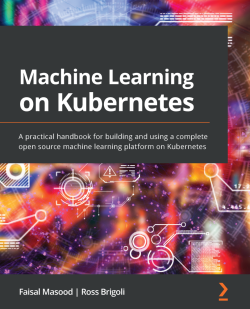

# [Book] [Faisal Masood, Ross Brigoli] Machine Learning on Kubernetes [ENG, 2022] (DEPRECATED)

### Technical requirements

• A central processing unit (CPU) with at least four cores; eight are recommended  
• Memory of at least 16 gigabytes (GB); 32 GB is recommended  
• Disk with available space of at least 60 GB

 

## Chapters:

**Part 1: The Challenges of Adopting ML and Understanding MLOps (What and Why)**

<ol>
  <li>📖 Challenges in Machine Learning</li>
  <li>📖 Understanding MLOps</li>
  <li>📖 Exploring Kubernetes</li>
</ol>

**Part 2: The Building Blocks of an MLOps Platform and How to Build One on Kubernetes**

<ol start="4">
  <li>The Anatomy of a Machine Learning Platform</li>
  <li>Data Engineering</li>
  <li>Machine Learning Engineering</li>
  <li>Model Deployment and Automation</li>
</ol>

**Part 3: How to Use the MLOps Platform and Build a Full End-to-End Project Using the New Platform**

<ol start="8">
  <li>📖 Building a Complete ML Project Using the Platform</li>
  <li>Building Your Data Pipeline</li>
  <li>Building, Deploying, and Monitoring Your Model</li>
  <li>📖 Machine Learning on Kubernetes</li>
</ol>

 

### [Development step by step](./docs/00-index.md)

 

---

 

**Marley**

Запуск примеров разбирался <a href="https://mlops.ru/books/machine-learning-on-kubernetes/">здесь</a>

  

---

 

<a href="https://k8s.ru/">Предложить инженеру работу / подработку на проекте с kubernetes, microservices, machine learning, golang</a>
